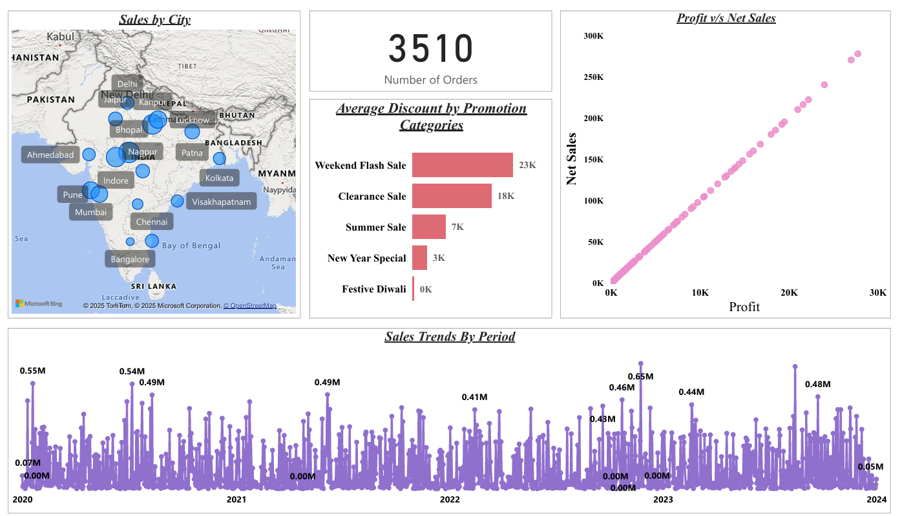
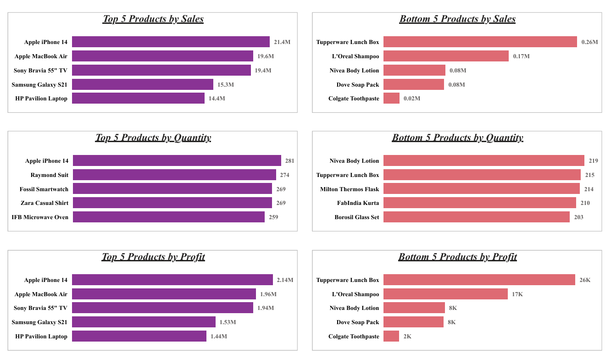
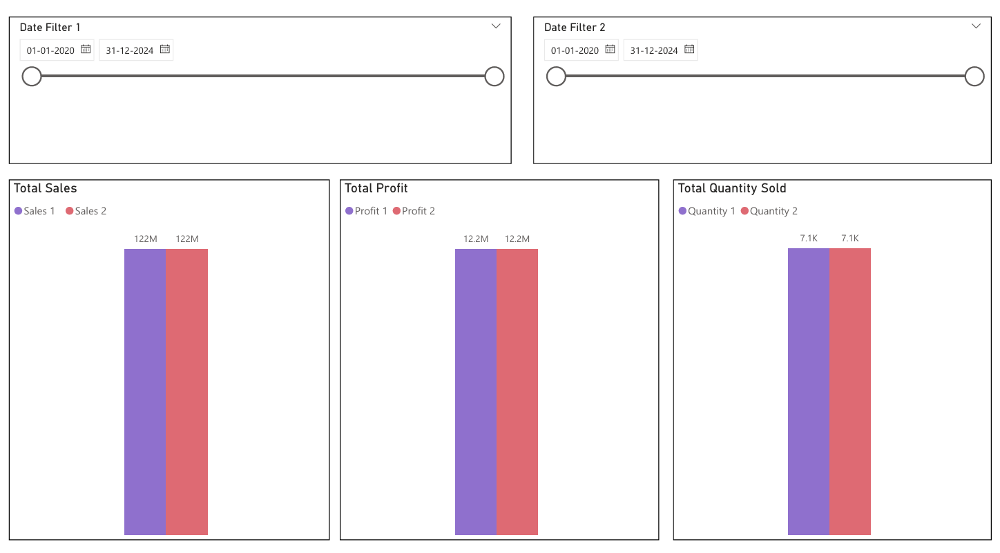
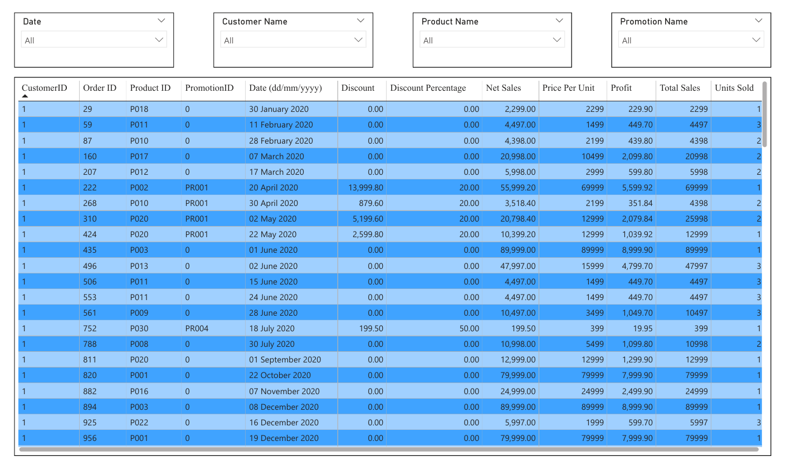

# Power BI Sales Analysis Dashboard

This repository contains a Power BI project (`project1.pbix`) designed to analyze sales performance. The dashboard provides a comprehensive overview of key business metrics, allowing users to drill down into product performance, profitability, and sales trends over time.

## 📊 Dashboard Preview

### Page 1: Main Dashboard Overview

### Page 2: Product Detail Analysis

### Page 3: Sales Trend View

### Page 4: Geographical Sales Map

## 📋 Project Features & Key Analyses

This report was built to answer several key business questions:

* **Product Performance:** Analyzes the **Top 5 and Bottom 5 products** based on Sales, Profit, and Quantity Sold.
* **Trend Analysis:** Tracks sales trends over time, with drill-down capabilities for **daily, monthly, quarterly, and annual** views.
* **Profitability Analysis:** Investigates the direct relationship between **Sales and Profit** using scatter plots or combination charts.
* **Period-over-Period Comparison:** Includes slicers and functionality to dynamically compare Sales, Profit, and Quantity Sold between any two user-selected time periods.
* **Discount Strategy:** Evaluates the **average discount** offered within each discount category to assess promotion effectiveness.
* **Key Performance Indicators (KPIs):** Features clear KPI cards for high-level metrics, including the **Total Number of Orders**.
* **Geographical Analysis:** A map visual shows **sales performance distributed by city**.
* **Granular Order Details:** A detailed table view allows users to see all metrics (Sales, Profit, Discount, Net Sales, etc.) for **each individual order**. This table can be filtered using visual filters for:
    * Product
    * Date
    * Customer ID
    * Promotion Categories

## 🛠️ Tools Used

* **Power BI Desktop:** Used for data modeling, creating DAX measures, and designing the report visuals.

## 📁 Data Source

The dataset consists of four separate CSV files (exported from an Excel file named `Store+Data.xlsx`) which are connected in Power BI to form a **star schema**.

This model consists of one fact table (containing transactions) and three dimension tables (containing descriptive attributes).

* **Fact Table:**
    * `Store+Data.xlsx - Sheet3.csv`: Contains the core transactional data, linking the dimension tables. This table includes metrics like Sales, Profit, and Quantity.

* **Dimension Tables:**
    * `Store+Data.xlsx - Dim Customers.csv`: A table containing all unique customer details, such as Customer ID and City.
    * `Store+Data.xlsx - Dim Product.csv`: A table containing all unique product details, such as Product Name and Category.
    * `Store+Data.xlsx - Dim Promotion .csv`: A table containing details on promotions, such as Promotion Category and Discount level.

The combined data model includes all key fields required for the analysis, such as Order Date, Product, City, Customer ID, Sales, Profit, Quantity, Discount, and Promotion Category.

